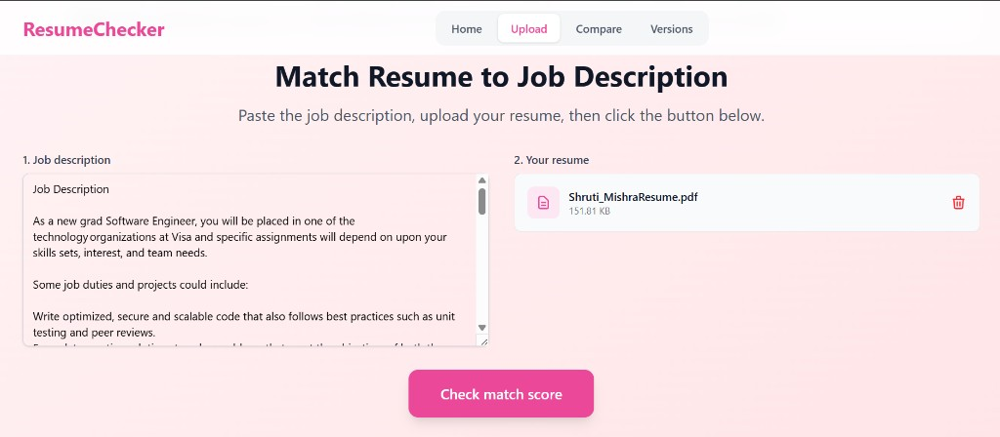
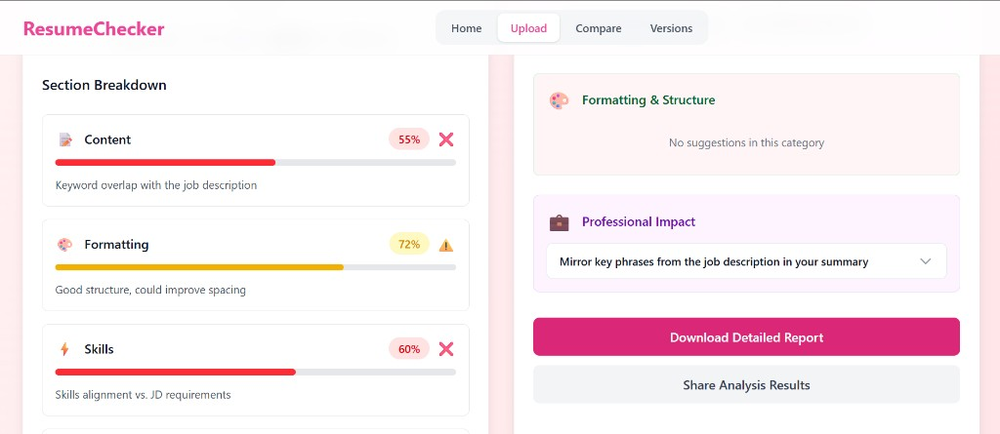

<div align="center">

# ResumeChecker

**Smart Resume Tracker** — paste a job description, upload your resume, and get an AI-powered match score with structured feedback. Compare versions, track improvements, and know exactly what to fix.

[](https://react.dev/)
[](https://vitejs.dev/)
[](https://tailwindcss.com/)
[](https://fastapi.tiangolo.com/)
[](https://www.mongodb.com/)
[](https://deepmind.google/technologies/gemini/)

[Features](#features) · [How it works](#how-it-works) · [Screenshots](#screenshots) · [Quick Start](#quick-start) · [API](#api-endpoints)

</div>

---

## Overview

ResumeChecker helps job seekers tailor their resumes to specific roles with precision. A **hybrid NLP pipeline** (TF-IDF + BERT + skill extraction) scores how well your resume aligns with a job description, and **Google Gemini 2.5 Flash** delivers structured, actionable feedback on exactly what to improve.

Built with a **React frontend** and a **FastAPI + MongoDB backend**, with JWT authentication and Cloudinary PDF storage.

---

## Features

| | Feature | Description |
|---|---|---|
| 🎯 | **Hybrid Match Score** | Combines skill extraction (spaCy), TF-IDF cosine similarity, and BERT semantic similarity into a single weighted score |
| 🤖 | **AI Feedback** | Gemini 2.5 Flash via LangChain returns 4-point structured feedback: missing skills, project phrasing, action verbs & metrics, match summary |
| 📊 | **Score Breakdown** | Separate scores for skill match, TF-IDF, BERT, and hybrid — so you know which dimension to improve |
| 🔍 | **Skill Gap Analysis** | Lists matched and missing skills extracted directly from the JD |
| 📁 | **Version Comparison** | Upload multiple resume versions and compare scores side by side with charts |
| 🗂️ | **Version History** | Browse all uploaded versions with per-version section scores and feedback |
| 🔐 | **Authentication** | JWT-based signup/login; all resume data is scoped to your account |
| ☁️ | **Cloud PDF Storage** | Resumes stored on Cloudinary; only the URL is saved in the database |

---

## How it works

```
User uploads PDF + pastes Job Description
            │
            ▼
   PDF text extracted from Cloudinary URL (PyMuPDF)
            │
            ▼
   ┌─────────────────────────────────┐
   │        Scoring Pipeline          │
   │                                  │
   │  1. Skill extraction (spaCy)     │
   │     → skill match score  (40%)   │
   │                                  │
   │  2. TF-IDF cosine similarity     │
   │     → keyword overlap    (30%)   │
   │                                  │
   │  3. BERT semantic similarity     │
   │     (all-MiniLM-L6-v2)           │
   │     → meaning match      (30%)   │
   │                                  │
   │  Hybrid = weighted average       │
   └─────────────────────────────────┘
            │
            ▼
   LangChain + Gemini 2.5 Flash
   → 4-point structured AI feedback
            │
            ▼
   Results saved to MongoDB
   Response returned to frontend
```

---

## Screenshots

### Home


### Upload — paste JD & resume


### Upload — match score & skill breakdown


### Upload — detailed analysis & AI feedback


### Compare — multiple resume versions


### Versions — history & details


---

## Tech stack

| Layer | Stack |
|---|---|
| Frontend | React 19, Vite 7, Tailwind CSS 4, Context API |
| Backend | FastAPI, MongoDB, JWT (python-jose), bcrypt |
| NLP | spaCy, scikit-learn TF-IDF, Sentence Transformers (BERT) |
| AI | LangChain, Google Gemini 2.5 Flash |
| Storage | Cloudinary (PDF), MongoDB (scores + metadata) |

---

## Project structure

```
smart-resume-tracker/
├── Backend/
│   ├── main.py              # FastAPI app + CORS
│   ├── auth.py              # Signup / login router
│   ├── auth_utils.py        # JWT helpers
│   ├── uploads.py           # Resume upload + analysis endpoint
│   ├── calculation.py       # TF-IDF, BERT, skill scoring pipeline
│   ├── ai_feedback.py       # LangChain + Gemini feedback
│   ├── database.py          # MongoDB connection
│   ├── getData.py           # User profile router
│   ├── schemas.py           # Pydantic models (auth)
│   ├── resume_Schemas.py    # Pydantic models (resume)
│   ├── utils.py             # Cloudinary upload helper
│   └── requirements.txt
├── frontend/
│   ├── src/
│   │   ├── views/           # HomeView, UploadView, CompareView, VersionsView, ProfileView
│   │   ├── components/      # FileUpload, ScoreBreakdown, SuggestionsPanel, VersionChart, TabGuide
│   │   ├── context/         # AuthContext
│   │   └── App.jsx
│   └── package.json
└── docs/screenshots/
```

---

## Quick start

### Prerequisites
- Node.js 18+
- Python 3.10+
- MongoDB Atlas URI
- Cloudinary account
- Google Gemini API key

### Frontend

```bash
cd frontend
npm install
npm run dev
```

Open http://localhost:5173

### Backend

```bash
cd Backend
pip install -r requirements.txt
python -m spacy download en_core_web_sm
```

Create `Backend/.env`:

```env
MONGO_URI=your_mongodb_connection_string
SECRET_KEY=your_jwt_secret_key
CLOUDINARY_CLOUD_NAME=your_cloud_name
CLOUDINARY_API_KEY=your_api_key
CLOUDINARY_API_SECRET=your_api_secret
GOOGLE_API_KEY=your_gemini_api_key
GENAI_MODEL=gemini-2.5-flash
```

```bash
uvicorn main:app --reload
```

API docs: http://localhost:8000/docs

---

## API Endpoints

| Method | Endpoint | Auth | Description |
|---|---|---|---|
| POST | `/auth/signup` | — | Register new user |
| POST | `/auth/login` | — | Login, receive JWT |
| POST | `/resume/upload-resume-analyze` | ✅ | Upload PDF + JD, get scores + AI feedback |
| GET | `/getme/profile` | ✅ | Current user profile and resume history |

---

## Deploy

### Frontend (Netlify / Vercel)

| Setting | Value |
|---|---|
| Base directory | `frontend` |
| Build command | `npm run build` |
| Publish directory | `frontend/dist` |

### Backend (Render / Railway)

Set all `.env` variables in your hosting dashboard, then run:

```bash
uvicorn main:app --host 0.0.0.0 --port 8000
```

---

## Author

**Shruti Mishra** — [@shrutii-mishra](https://github.com/shrutii-mishra)

---

<div align="center">

**ResumeChecker** · smart-resume-tracker

</div>
