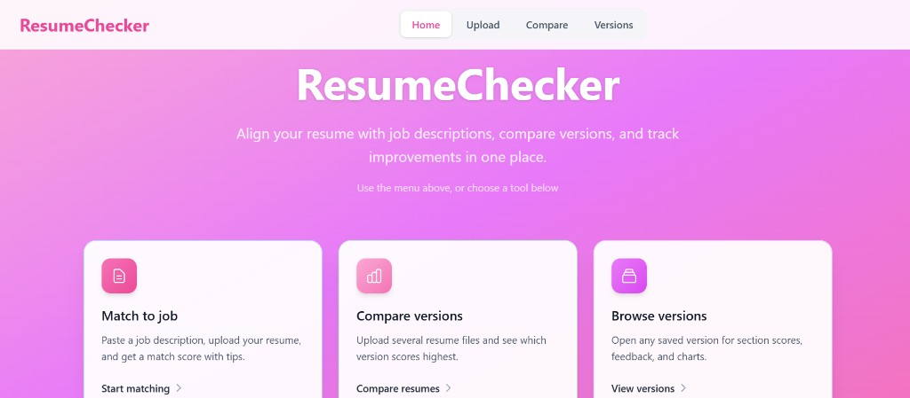
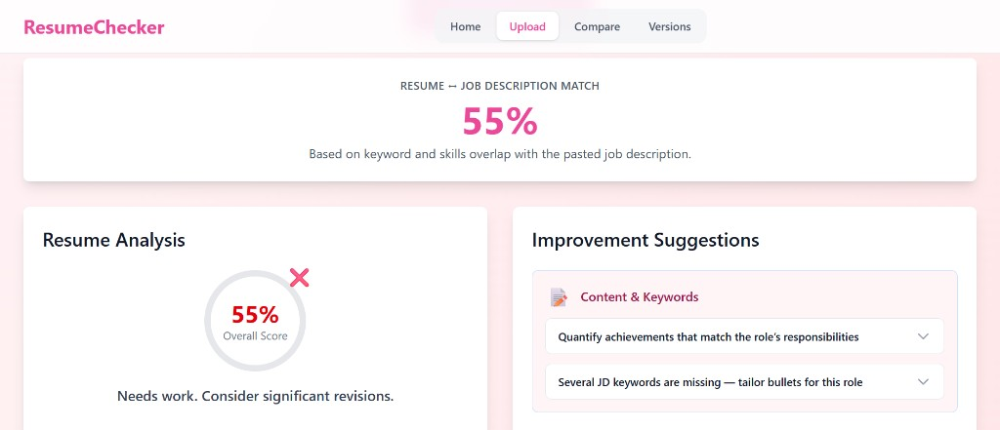
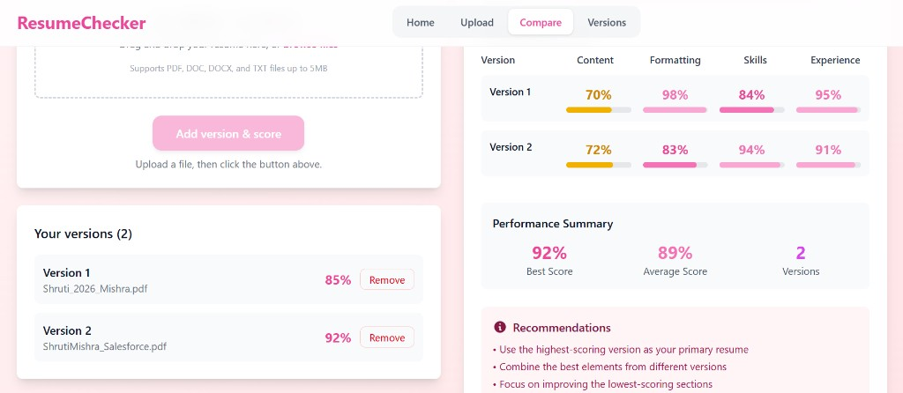
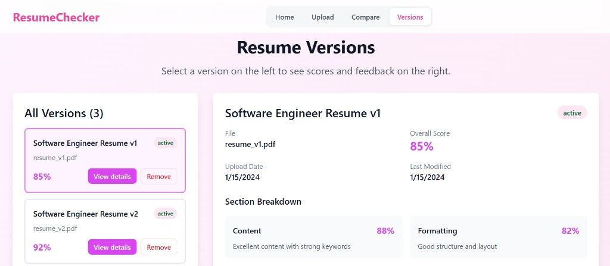

<div align="center">

# ResumeChecker

**Smart Resume Tracker** — analyze resume fit against job descriptions, compare versions, and review structured feedback.

[](https://react.dev/)
[](https://vitejs.dev/)
[](https://tailwindcss.com/)
[](https://fastapi.tiangolo.com/)

[Repository](https://github.com/shrutii-mishra/smart-resume-tracker) · [Features](#features) · [Screenshots](#screenshots) · [Quick start](#quick-start)

</div>

---

## Overview

**ResumeChecker** (repository: [smart-resume-tracker](https://github.com/shrutii-mishra/smart-resume-tracker)) is a web application for candidates who need to tailor resumes to specific roles. Paste a job description, upload a resume, and receive a match score with section-level feedback. Compare multiple resume files and review version history in a single interface.

The frontend runs as a standalone demo today; a FastAPI + MongoDB backend is included for future integration (authentication, persistence, and AI-powered analysis).

---

## Screenshots

Place images in `docs/screenshots/` using the filenames below.

| Screen | File | Description |
|--------|------|-------------|
| Home | `home.png` | Landing page |
| Upload | `upload-match.png` | Job description, resume upload, match score |
| Compare | `compare.png` | Version comparison chart |
| Versions | `versions.png` | Version list and detail view |

### Home



### Upload — resume vs. job description



### Compare



### Versions



---

## Features

| Module | Description |
|--------|-------------|
| **Upload** | Paste a job description, upload a resume, run **Check match score** for alignment % and suggestions |
| **Compare** | Add multiple resume files with **Add version & score**; view side-by-side chart |
| **Versions** | Browse versions, open **View details** for section scores and feedback |
| **Tab guides** | In-page help on each screen (steps and expected results) |
| **State retention** | Switching tabs keeps your inputs; each tab scrolls back to the top |

---

## Tech stack

| Layer | Stack |
|-------|--------|
| Frontend | React 19, Vite 7, Tailwind CSS 4 |
| Backend | FastAPI, MongoDB, JWT (cookie-based auth) |
| Planned | Resume parsing, JD matching (LangChain / GenAI in `Backend/`) |

---

## Project structure

```
smart-resume-tracker/
├── frontend/           # React application
├── Backend/            # FastAPI services
├── docs/screenshots/   # README images
└── README.md
```

---

## Quick start

### Frontend

Requires **Node.js 18+** (20 LTS recommended).

```bash
cd frontend
npm install
npm run dev
```

Open http://localhost:5173/

### Backend (optional)

```bash
cd Backend
pip install -r requirements.txt
```

Create `Backend/.env`:

```env
MONGODB_URI=your_connection_string
JWT_SECRET=your_secret
```

```bash
uvicorn main:app --reload
```

API documentation: http://localhost:8000/docs

---

## Deploy (Netlify)

| Setting | Value |
|---------|--------|
| Base directory | `frontend` |
| Build command | `npm run build` |
| Publish directory | `frontend/dist` |

---

## Roadmap

- [ ] Connect frontend to backend APIs
- [ ] Server-side resume parsing and JD matching
- [ ] User-scoped version storage in MongoDB

---

## Author

**Shruti Mishra** — [@shrutii-mishra](https://github.com/shrutii-mishra)

---

<div align="center">

**ResumeChecker** · smart-resume-tracker

</div>
